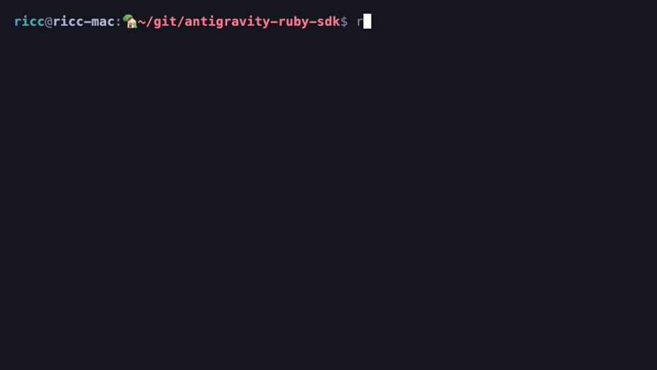
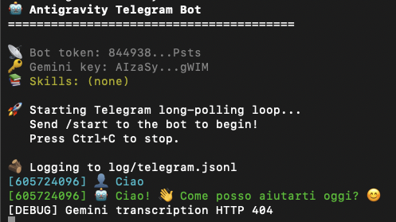
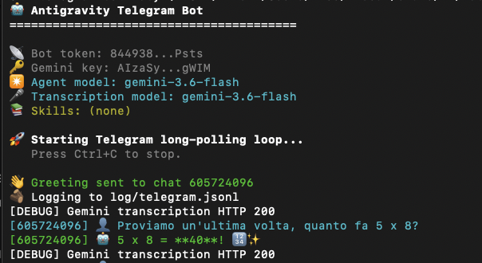

The Antigravity Ruby SDK is an unofficial, community project. It is **not** an official Google product.

# 💎 Antigravity Ruby SDK

<p align="center">
  
</p>

<p align="center">
  
</p>

[](https://rubygems.org/gems/antigravity-sdk)
[](LICENSE)

An elegant, expressive Ruby SDK for building autonomous AI agents with **Google Antigravity**.

> **Gem**: [`antigravity-sdk`](https://rubygems.org/gems/antigravity-sdk) on RubyGems
> **Source**: [`palladius/antigravity-ruby-sdk`](https://github.com/palladius/antigravity-ruby-sdk) on GitHub

Inspired by [RubyLLM](https://rubyllm.com) and the Ruby philosophy of developer happiness: configure agents, stream responses, load skills from GitHub, analyze workspaces, and attach safety guards -- all with minimal boilerplate.

```ruby
agent = Antigravity::Agent.new(
  skills: ["./skills/code-quality-review"],
  workspace: "."
)

agent.ask("Review this codebase for best practices") { |chunk| print chunk.content }
```

---

## ⚡ Zero-Install Quickstart with `rv`

No `gem install` needed — run directly with [rv](https://github.com/nicholasgasior/rv):

```bash
# Simple chat
rv run ruby examples/04_simple_llm_chat.rb

# Workspace analysis (indexes your project, asks about it)
rv run ruby examples/05_workspace_analysis.rb ~/git/my-app

# Code quality review with skills
rv run ruby examples/06_skill_security_audit.rb .

# Load SRE skills from GitHub and draft a post-mortem
rv run ruby examples/07_skill_sre_postmortem.rb .
```

Or with `just`:
```bash
just rv-chat                    # Simple LLM chat
just rv-workspace               # Workspace analysis
just rv-skill-audit             # Code review with local + inline skills
just rv-skill-sre-postmortem    # SRE post-mortem from GitHub skills
```

---

## 📚 Agent Skills

Skills are reusable instruction sets (SKILL.md files) that teach agents new capabilities. Load them from local folders, GitHub repos, or define them inline:

```ruby
agent = Antigravity::Agent.new(
  # Mix local and remote skills in the constructor
  skills: [
    "./skills/code-quality-review",                           # Local
    "https://github.com/gemini-cli-extensions/sre",           # GitHub (auto-clones all 16 skills!)
  ]
)

# Add a specific skill from a GitHub repo
agent.add_skill("https://github.com/gemini-cli-extensions/sre", skill_name: "skills/postmortem-generator")

# Define a skill inline (no file needed)
agent.add_inline_skill(
  name: "emoji-formatter",
  description: "Formats output with emoji severity markers",
  instructions: "Use: CRITICAL: 🚨, HIGH: 🔴, MEDIUM: 🟡, LOW: 🔵, PASSED: ✅"
)

# Discover skills in a folder
Agent.list_skills("~/git/skillume/sre-extension/")
# => ["/path/to/anomaly-detection", "/path/to/cloud-logging", ...]
```

---

## 📂 Workspace Analysis

Point an agent at a directory — it indexes the files and uses built-in tools (`list_dir`, `view_file`, `grep_search`) to explore:

```ruby
agent = Antigravity::Agent.new(workspace: "~/git/my-project")
agent.connect!
agent.ask("What tech stack does this project use?") { |c| print c.content }
agent.close!
```

---

## 🪵 Automagic Logging

Dual-output logging out of the box:

- `log/antigravity.jsonl` — structured telemetry (request/response sizes, tool calls)
- `log/antigravity.log` — compact human-readable one-liners
- Auto-attaches `Rails.logger` in Rails apps

```ruby
agent = Antigravity::Agent.new  # Logging just works!
# => 🪵 Logging to log/antigravity.jsonl
```

---

## 🛡️ Guards & Sidecars

```ruby
agent = Antigravity::Agent.new do |a|
  a.system_instruction = "You are a helpful Ruby assistant."
  a.attach_sidecar(Antigravity::Sidecar::AuditLogger.new("log/audit.jsonl"))
  a.before_tool_call(&Antigravity::Guards::FileProtection.new)
  a.after_tool_call(&Antigravity::Guards::SecretMasker.new)
end
```
---

## 🔒 Declarative Policy DSL

Control what your agent can and can't do with a beautiful, Rails-like DSL:

```ruby
agent = Antigravity::Agent.new(policy: :default)   # Use a preset
agent = Antigravity::Agent.new(policy: :cautious)   # Locked down for prod
agent = Antigravity::Agent.new(policy: :turbo)      # Wide open for dev
agent = Antigravity::Agent.new(policy: :auto)       # Picks from RAILS_ENV!
```

Or define a custom policy:

```ruby
policy = Antigravity::Policy.define do
  deny_all
  allow :view_file
  allow :grep_search
  allow :run_command, when: cmd('echo', 'git status', 'bundle exec rspec')
  allow :write_to_file
  deny  :write_to_file, when: path('.env', '*.key', '*.pem')
  deny  :run_command,   when: cmd('rm', 'git reset --hard')
end

agent = Antigravity::Agent.new(policy: policy)
```

### ⚠️ Order does NOT matter!

The DSL is **declarative** — like SQL, not like a script.
Rules are resolved by **precedence**, not by insertion order.
These two policies behave **identically**:

```ruby
# Order A                           # Order B
Policy.define do                    Policy.define do
  allow :run_command                  deny :run_command, when: cmd('rm')
  deny :run_command,                  allow :run_command
    when: cmd('rm')                 end
end
```

Precedence (highest wins):

1. **Tool specificity**: `deny :run_command` beats `deny_all`
2. **Condition specificity**: `deny :run_command, when: cmd('rm')` beats `deny :run_command`
3. **Restrictiveness**: `deny` beats `confirm` beats `allow`

### 📋 Presets

| Preset | Shell | Writes | `rm` | `git reset --hard` | Best for |
|--------|-------|--------|------|---------------------|----------|
| 🔒 `:cautious` | Safe only (`echo`, `pwd`) | Confirm | ❌ Deny | ❌ Deny | Production |
| ⚖️ `:default` | Allow | Allow | ⚠️ Confirm | ⚠️ Confirm | Day-to-day dev |
| 🚀 `:turbo` | Allow | Allow | Allow | ⚠️ Confirm | Rapid prototyping |
| 🧪 `:test` | Allow | Allow | ⚠️ Confirm | ❌ Deny | CI / test suites |
| 🔮 `:auto` | — | — | — | — | Reads `RAILS_ENV` |

### 📂 Sandbox directories

`scratch/` and `out/` are **always writable**, even in `:cautious` / production.
Use them as throwaway output dirs:

```ruby
# In production — this works!
agent.hooks.run_pre_tool(:write_to_file, path: 'scratch/debug.log', content: '...')
# => { allowed: true }

# But this is blocked:
agent.hooks.run_pre_tool(:write_to_file, path: 'app.rb', content: '...')
# => { allowed: false, reason: "Denied by policy" }
```

### 🔮 Auto-mapping from RAILS_ENV

`policy: :auto` reads `ANTIGRAVITY_ENV` → `RAILS_ENV` → `RACK_ENV`:

| Environment | Preset |
|-------------|--------|
| `development` / `dev` | 🚀 `:turbo` |
| `test` | 🧪 `:test` |
| `staging` | ⚖️ `:default` |
| `production` / `prod` | 🔒 `:cautious` |
| *(unset)* | ⚖️ `:default` |

See [`lib/antigravity/policy.rb`](lib/antigravity/policy.rb) and [`lib/antigravity/policy/constants.rb`](lib/antigravity/policy/constants.rb) for the full implementation.

---

## 📊 Feature Parity with [Python SDK](https://github.com/google-antigravity/antigravity-sdk-python)

> Full matrix: [`docs/FEATURE_PARITY.md`](docs/FEATURE_PARITY.md) | Epic: [GHI #20](https://github.com/palladius/antigravity-ruby-sdk/issues/20)

| Feature | Status | Notes |
|---------|--------|-------|
| Agent lifecycle (`connect!`, `close!`, block) | ✅ | + auto-connect on first `ask` |
| Streaming responses | ✅ | Token-by-token via block |
| Custom tools (declarative + dynamic) | ✅ | `Tool` DSL + `Tool::Dynamic` |
| Agent Skills (local + GitHub + inline) | ✅ | Ruby-only: GitHub auto-clone, inline skills |
| Workspace analysis | ✅ | Built-in file tools |
| Guards (FileProtection, SecretMasker) | ✅ | Ruby-only feature |
| Sidecars (AuditLogger, VulnScanner) | ✅ | Ruby-only feature |
| Hooks (pre/post prompt, tool) | ✅ | + generic event system |
| Logging (JSONL + .log) | ✅ | Auto-attach |
| Declarative Policies | ✅ | [#21](https://github.com/palladius/antigravity-ruby-sdk/issues/21) — DSL, 5 presets, sandbox dirs |
| MCP Servers (Stdio + HTTP) | ❌ | Planned P0 |
| Multimodal Input (Image, Audio, Doc) | ❌ | Planned P1 |
| Structured Output (JSON Schema) | ❌ | Planned P1 |
| Stateful ToolContext | ❌ | Planned P1 |
| Session Persistence (save/resume) | ❌ | Planned P1 |
| Multi-Agent / Subagents | ❌ | Planned P2 |
| Triggers (background tasks) | ❌ | Planned P2 |
| Vertex AI backend | ❌ | Planned P1 |
| Response Cancellation | ❌ | Planned P1 |
| Budget Limits | ❌ | Planned P1 |
| OpenTelemetry | ❌ | Planned P2 |
| LiteRT / Ollama backends | ❌ | Planned P3 |

**Overall: ~40% parity** | 10 Ruby-only features | [Convergence plan](docs/FEATURE_PARITY.md#prioritized-gap-closure-plan)

## 🧪 Development

```bash
just test           # 76 unit specs (fast, no harness needed)
just integration    # Integration tests (requires GEMINI_API_KEY)
just rv-examples    # Run all rv examples
```


## 🤖 Telegram Integration

Chat with your Antigravity agent on Telegram — text and voice messages with automatic transcription!

1. Create a bot with [@BotFather](https://t.me/BotFather)
2. Add these to your `.env`:

```bash
TELEGRAM_BOT_TOKEN=your-token-from-botfather
TELEGRAM_CHAT_ID=your-chat-id        # Optional: enables startup greeting
TELEGRAM_SKILLS=./skills/my-skill    # Optional: comma-separated skill paths/URLs
```

3. Run:

```bash
just rv-skill-telegram
```

Commands: `/start` `/skills` `/stop` — supports voice messages with 🇮🇹🇬🇧🇪🇸 language detection.

See `.env.dist` for all available options.





## 🔗 Related Projects

| Project | Language | Link |
|---------|----------|------|
| **Antigravity Python SDK** (official) | Python | [google-antigravity/antigravity-sdk-python](https://github.com/google-antigravity/antigravity-sdk-python) |
| **Antigravity Java SDK** (unofficial) | Java | [glaforge/antigravity-java-sdk](https://github.com/glaforge/antigravity-java-sdk) |
| **Antigravity Ruby SDK** (this repo) | Ruby | [palladius/antigravity-ruby-sdk](https://github.com/palladius/antigravity-ruby-sdk) |
| **antigravity-sdk gem** | RubyGems | [rubygems.org/gems/antigravity-sdk](https://rubygems.org/gems/antigravity-sdk) |

---

## 📄 License

Apache 2.0 - see `LICENSE` for details.

*The Antigravity Ruby SDK is an unofficial, community project. It is **not** an official Google product.*
